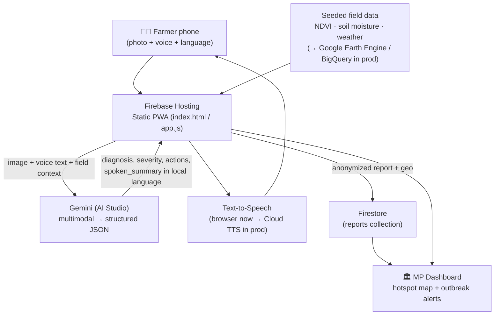

# Architecture — Kisan Alert

## Data flow

## Component responsibilities
| Layer | Service | Job | Status tonight |
| --- | --- | --- | --- |
| Front end | **Firebase Hosting** | Serve static PWA, scale free | ✅ live |
| Reasoning | **Gemini (AI Studio key)** | Multimodal image+text → structured advisory JSON | ✅ live |
| Voice in | Browser SpeechRecognition → **Cloud Speech-to-Text** (prod) | Farmer speaks, no typing | ✅ live (browser) |
| Voice out | Browser SpeechSynthesis → **Cloud Text-to-Speech** (prod) | Speak advisory aloud in Indic language | ✅ live (browser) |
| Field data | **Google Earth Engine + BigQuery** | NDVI, soil moisture, weather per pincode | 🟡 seeded JSON |
| Storage | **Firestore** | Persist anonymized reports | ✅ optional |
| Map | **Google Maps JS API** | Constituency hotspot map | ✅ live (offline SVG fallback) |
| Feature phones | **Dialogflow CX + telephony** | Toll-free IVR, zero-app access | 🔵 roadmap |

## Why this scales
The front end is static (CDN-cached, near-zero cost). Every AI request is a stateless serverless call to Gemini Flash — elastic, pay-per-use (~fractions of a rupee per advisory). Firestore is multi-region and constituency data is isolated by configuration, so national rollout is a config change, not a rewrite.

## Prompt contract
`app.js → buildPrompt()` forces Gemini to return strict JSON (`responseMimeType: application/json`) with fields `diagnosis, severity, water, pest, fertilizer, scheme_line, spoken_summary`, all written in the farmer's chosen language. Low temperature (0.3) keeps advice consistent and practical; every reply routes the farmer to the nearest KVK for confirmation.
